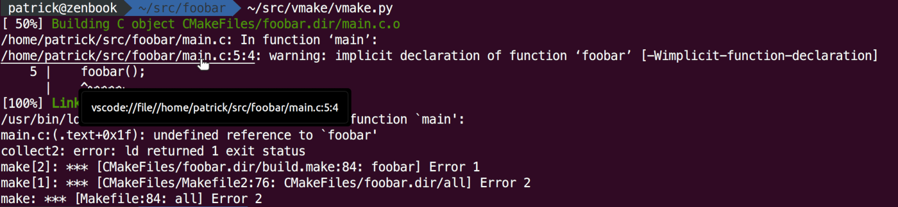

# vmake

This is a small wrapper for `make`, which captures `gcc` output and transforms errors/warnings to hyperlinks that open the Visual Studio Code editor for the referenced files at the respective locations.

It takes advantage of [OSC8 escape sequence for hyperlinks](https://gist.github.com/egmontkob/eb114294efbcd5adb1944c9f3cb5feda) and the [VSCode URL handler](https://code.visualstudio.com/docs/editor/command-line#_opening-vs-code-with-urls).

## Prerequisites

* gcc, make
* Visual Studio Code or VSCodium
* A [terminal emulator with support for hyperlinks](https://gist.github.com/egmontkob/eb114294efbcd5adb1944c9f3cb5feda#file-hyperlinks_in_terminal_emulators-md)

## Example

